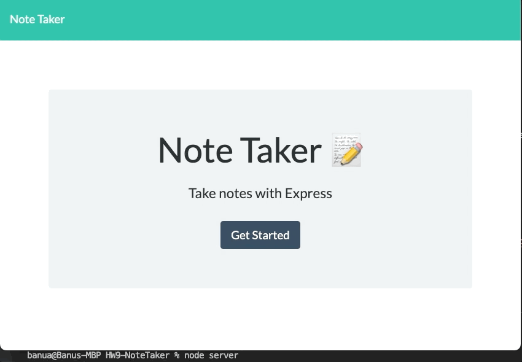

# Note Taker
  
[](https://opensource.org/licenses/MIT)

## Table of Contents
- [Descriptions](#Description)
- [Installation](#Installation)
- [Usage](#Usage)
- [Contributers](#Contributers)
- [Tests](#Tests)
- [Questions](#Questions)

## Description
The Note Taker Application can be used to write and save notes. This application uses an Express.js back end. It saves and retrieves note data from a JSON file. The application’s front end is provided by Trilogy Education Services, LLC. Back end is built and connected to front end.

## Installation
### Entire application is deployed to Heroku. 
https://notetakerdeployed.herokuapp.com/

### To Use Locally;
1. Be sure that "node.js" is installed to your local machine. (see <a href="https://nodejs.org/en/download/" rel="nofollow">offical website</a> for installation)
2. Clone this repo and open that folder in terminal.
3. Install npm packages by running 
    ```bash
    npm init -y-- npm install
    ```
4. Install npm nodemon: 
    ```bash
    npm i -D nodemon
    ```
5. Install npm express
    ```bash
    npm install express
    ```
6. Start the server
    ```bash
    node server
    ```
7. Open your browser and go to http://localhost:8080/

## Usage
The following image show the web application's appearance and functionality:


```
GIVEN a note-taking application
WHEN I open the Note Taker
THEN I am presented with a landing page with a link to a notes page
WHEN I click on the link to the notes page
THEN I am presented with a page with existing notes listed in the left-hand column, plus empty fields to enter a new note title and the note’s text in the right-hand column
WHEN I enter a new note title and the note’s text
THEN a Save icon appears in the navigation at the top of the page
WHEN I click on the Save icon
THEN the new note I have entered is saved and appears in the left-hand column with the other existing notes
WHEN I click on an existing note in the list in the left-hand column
THEN that note appears in the right-hand column
WHEN I click on the Write icon in the navigation at the top of the page
THEN I am presented with empty fields to enter a new note title and the note’s text in the right-hand column
```

## Contributers
There were no other collaborators for this project.

## Tests
There are no tests for this project.

## Questions
If you have any questions, please send an email to banu@breative.net or reach me through https://github.com/banuakman